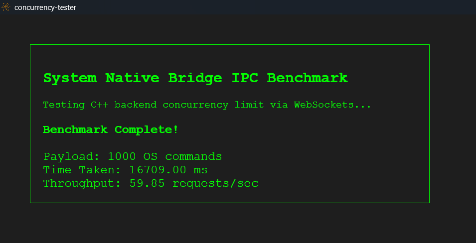

# Neutralinojs IPC Concurrency Benchmark

## Overview
This project is a lightweight stress-testing tool designed to benchmark the Inter-Process Communication (IPC) architecture of [Neutralinojs](https://neutralino.js.org/). 

While exploring the framework core (C++) and client library (JavaScript), I wanted to test the execution limits of its WebSocket messaging protocol. Instead of building a standard UI dashboard, this tool floods the C++ backend with highly concurrent asynchronous native API requests (`os.execCommand`) to measure latency, throughput, and stability under heavy load.

## Benchmark Results
In the initial stress test, the WebSocket bridge was flooded with **1,000 concurrent native OS requests** using `Promise.all()`. 

* **Payload:** 1,000 concurrent `os.execCommand` executions
* **Time Taken:** 16,709 ms (~16.7 seconds)
* **Throughput:** 59.85 requests/second
* **Stability:** The C++ backend and WebSocket router successfully queued and resolved all requests without dropping connections or causing memory faults. 

* **Screenhot :**  

## How to Run Locally
1. Clone this repository.
2. Ensure you have the Neutralinojs CLI installed: 
   `npm install -g @neutralinojs/neu`
3. Run the application:
   `neu run`

## About the Author
I am **Avadhut Mali**, a third-year Computer Science and Engineering student at Walchand College of Engineering, Sangli. I specialize in backend architecture, C++, and concurrency. With a strong foundation in dynamic programming and competitive programming, I enjoy breaking down low-level system designs, which led me to dive deep into Neutralinojs's cross-platform native bridge for GSoC 2026.